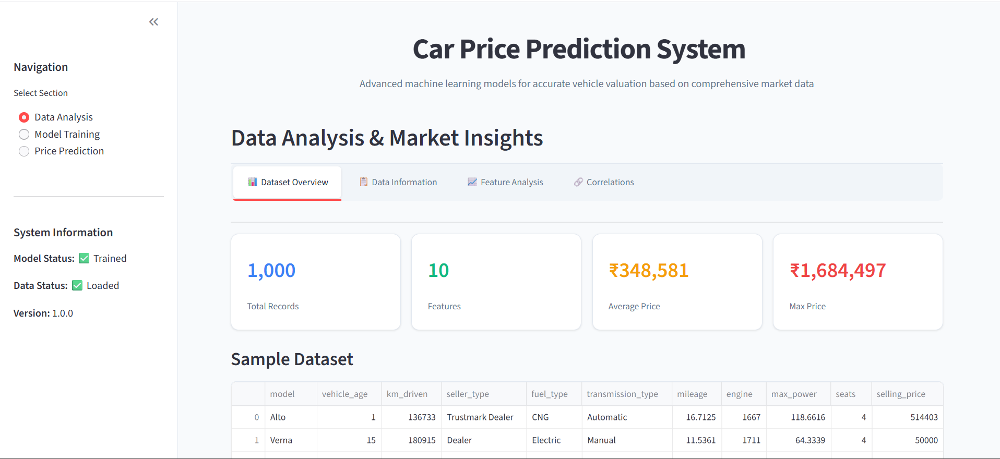

## Car Price Prediction using Random Forest Regression

Predict used car prices with a production-style, interactive Streamlit app and a modular training pipeline. The solution includes EDA, preprocessing, model comparison, hyperparameter tuning, and artifact saving for deployment.



### Key Features
- **Interactive app**: Data exploration, model training, and real-time prediction in one UI (`app.py`).
- **Multiple algorithms**: Linear/Lasso/Ridge, KNN, Decision Tree, and Random Forest with visual comparisons.
- **Tuned models**: Randomized hyperparameter search for KNN and Random Forest.
- **Reusable pipeline**: Clean training script with artifact saving (`modeltraining.py`).
- **Artifacts**: Persisted model, preprocessor, label encoder, and feature info in `models/`.

### Tech Stack
- **Python**, **Streamlit**, **pandas**, **NumPy**, **scikit-learn**, **Plotly**, **Matplotlib**, **Seaborn**, **joblib**

---

### Project Structure
```
.
├── app.py                      # Streamlit app (EDA, training, prediction)
├── modeltraining.py            # End-to-end training pipeline
├── data/
│   └── cardekho_imputated.csv  # Dataset (CSV)
├── models/                     # Saved artifacts after training
│   ├── best_model.pkl
│   ├── preprocessor.pkl
│   ├── label_encoder.pkl
│   └── feature_info.pkl
├── requirements.txt            # Python dependencies
├── systemui.png                # App UI screenshot
└── README.md
```

---

### Getting Started
Prerequisites:
- Python 3.9+ recommended
- Pip

Install dependencies:
```bash
pip install -r requirements.txt
```

Run the Streamlit app:
```bash
streamlit run app.py
```

The app provides three sections via the sidebar:
- **Data Analysis**: Explore dataset, distributions, and correlations.
- **Model Training**: Configure split, train multiple models, and compare metrics (R², RMSE, MAE).
- **Price Prediction**: Enter vehicle specs and get an estimated market value with range and insights.

---

### Training via Script (CLI)
To train models from the command line and save artifacts to `models/`:
```bash
python modeltraining.py
```

The script pipeline includes:
1) Load and clean data from `data/cardekho_imputated.csv`
2) Feature preparation with Label Encoding and One-Hot Encoding + scaling
3) Train/test split
4) Baseline model training and evaluation
5) Hyperparameter tuning (KNN, Random Forest)
6) Final model evaluation and selection (by test R²)
7) Save artifacts: `best_model.pkl`, `preprocessor.pkl`, `label_encoder.pkl`, `feature_info.pkl`

---

### Model Artifacts
After successful training, the following files are stored in `models/`:
- `best_model.pkl`: The best-performing regressor
- `preprocessor.pkl`: `ColumnTransformer` with scaling and one-hot encoding
- `label_encoder.pkl`: Label encoder for the `model` feature
- `feature_info.pkl`: Reference metadata for categorical/numerical features

These are loaded by the app to perform consistent preprocessing and inference.

---

### Data
Expected input file: `data/cardekho_imputated.csv`
- Contains features like `model`, `vehicle_age`, `km_driven`, `seller_type`, `fuel_type`, `transmission_type`, `mileage`, `engine`, `max_power`, `seats`, and target `selling_price`.
- The Streamlit app can also run in a demo mode using generated sample data if training hasn’t been completed.

---

### Results & Metrics
The app compares models visually and numerically with:
- **R² (coefficient of determination)**
- **RMSE (root mean squared error)**
- **MAE (mean absolute error)**

It highlights the best model and shows train vs test behavior for overfitting checks.

---

### How to Use the App
1) Launch the app: `streamlit run app.py`
2) Go to **Model Training** and click “Start Training” (or rely on demo mode for predictions).
3) Use **Price Prediction** to input vehicle attributes and obtain an estimated price and range.

---

### Notes
- Ensure the `data/` directory exists and the CSV path matches `modeltraining.py` defaults.
- If running on Windows PowerShell, you may need: `python -m pip install -r requirements.txt`.
- For reproducibility, set the `Random State` in the UI before training.

---

### License
This project is open for educational and demonstration purposes. Add a suitable license (e.g., MIT) if you plan to distribute.
